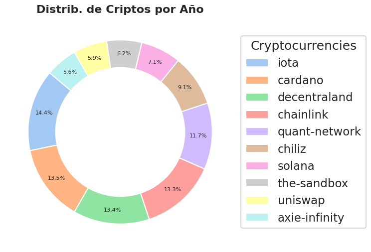
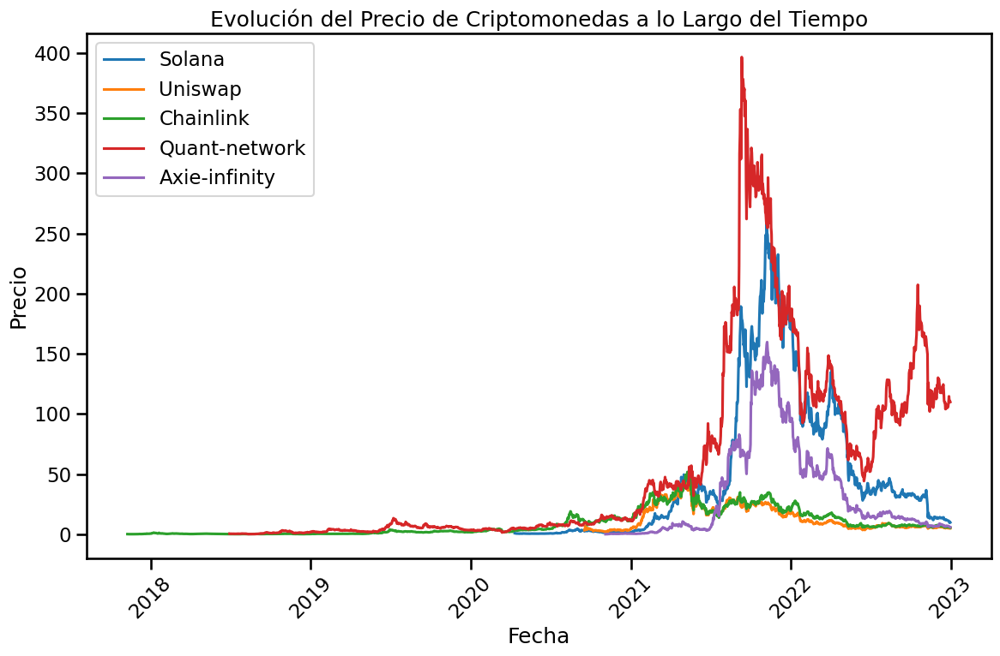
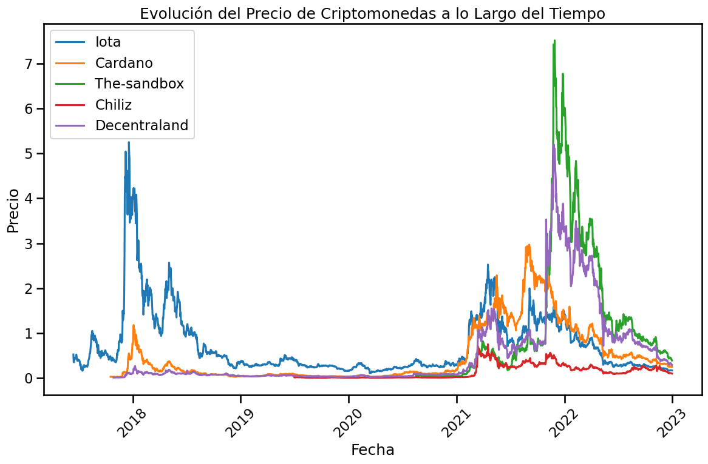

##  

---

# <h1 align="CENTER">**`Cryptocurrency Market Data Analytics`**</h1>

---

## Technologies used in this project:

- **Streamlit**
- **Altair**
- **Matplotlib**
- **Numpy**
- **Pandas**
- **Seaborn**
- **pycoingecko**
- **Modin**
- **Pandas profiling**

---

### Selected KPIs:

- 5% Overall Annual Growth of all chosen cryptocurrencies

- 3% Growth Every 6 months of Trading Volume

- 1 Dollar per month of price increase for each cryptocurrency

    

---

# <h1 align="CENTER">**`Project Folder:`**</h1>

##

- #### DataSets: All the datasets available for analysis are stored in this folder.

  - #### Data Ingested: Raw data is stored in this folder.
    - Crypto_data_general.csv
    - Crypyo_emerging_data_with_time.csv
  - #### Data Processes: The processed data is stored in this folder.
  - #### EDA_ET: All the files ingested and processed from the ETL, EDA and modeling process are stored in this folder.
    - EDA.ipynb
    - ETL.ipynb
    - utils.py: module created to host necessary functions for EDA, ETL and modeling.

- #### .gitignore: This file ignores files that are not relevant to the project but were needed to make it.
- #### main.py: file where the API functions are loaded.
- #### README.md

---

## <h1 align="center">**`Objective of the project`**</h1>

  

  
My main objective in this project is to carry out a comprehensive analysis of the cryptocurrency market. The main objective is to obtain valuable information on this dynamic market, which will serve as a valuable reference for a financial services company. The analysis will focus on understanding the economic landscape and identifying potential business opportunities.

---

## <h1 align="center">**`Selection of cryptocurrencies`**</h1>

  

To achieve this goal, a meticulous selection process has been carried out to identify the top 10 cryptocurrencies that best represent significant trading potential. These chosen cryptocurrencies will play a pivotal role in accurate market modeling.

The selection process consists of several stages:

1. **Initial Research:** Conducted an initial research phase to gather information on various cryptocurrencies.
2. **Evaluation criteria:** Specific criteria established to evaluate the potential of each cryptocurrency.
3. **Comprehensive Analysis:** Conducted a comprehensive analysis of each cryptocurrency based on factors such as market capitalization, adoption rate, technological innovation, and community engagement.

---

## <h1 align="center">**`Selected Cryptocurrencies`**</h1>

  

Following a rigorous evaluation process, the following 10 cryptocurrencies have been identified as the most promising and representative of potential trading opportunities:

- Solana
- Chiliz
- Uniswap
- Decentraland
- Axie Infinity
- The Sandbox
- Cardano
- Iota
- Quant
- Chainlink
- VeChain

Select these cryptocurrencies because from 2015 to here they have sustained growth and are becoming Emerging.

These selected cryptocurrencies are poised to offer valuable insights into the broader economic landscape and serve as a basis for strategic decision-making in the realm of financial services.

---

## <h1 align="center">**`Descriptive analysis:`**</h1>

##  Distribution in the coin market of the chosen ones: 

##  Evolution of the prices of Cryptocurrencies since its Appearance: 

#### I separated them into a couple of graphs to visualize, the evolution of their respective prices because they have very wide scales uneven. What complicates and hinders the visualization.

##### -  Solana:, Uniswap:, Chainlink:, Quant:, Axie infinity: 

##### -  Iota:, Cardano:, The Sandbox:, Chilix:, Decentraland: 

- It is observed how the grouping of coins consists of different scales due to their characteristics. In addition, there is a trend in recent times. Since 2021 in all the currencies, which were chosen to qualify as emerging, there is a strong sustained rise.

---
